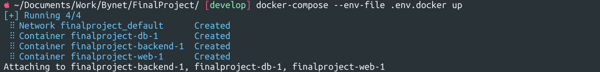

# Description Exercise4

To start the project, run the command:
```bash
docker-compose --env-file .env.docker up
```
* ```--env-file```  - flag for using file with environments variables.
* ```.env.docker``` - file name with variables.

This file ```.env.docker``` should be created manually, because it has confidential information and has not been uploaded to the repository. U can use template:
```bash
# .env for docker-compose
POSTGRES_PASSWORD=db_password
POSTGRES_USER=dbusername
POSTGRES_DB=name


POSTGRES_NAME=name
POSTGRES_USER=dbusername
POSTGRES_PASSWORD=db_password
DATABASE_PORT=db_port
BACKEND_PORT=port_backend
REMOTE_HOST=IP_ADDRESS
REMOTE_PORT=22
REMOTE_USER=username
REMOTE_PASSWORD=password
REMOTE_FOLDER=/var/tmp/csv_files

DATABASE_HOST=db        # This env you can change on service for connect into Kubernetes Cluster 
BACKEND_URL=backend     # This env you can change on service for connect into Kubernetes Cluster 
```


## The project has 3 services:

* db
* backend
* web

---
### DB:

The image is taken as a basis ```postgres:14-alpine```

Parametr ```restart: always``` used to restart the service in case of a global error 

Data is stored outside the container using ```volumes``` into project's folder ```./data/db```

Used port by default ```5432```. But this is only used for debugging, since open ports are not required to run docker-compose.

And the various environment variables to run are listed and taken from the file ```.env.docker```:
```yaml
- POSTGRES_PASSWORD=${POSTGRES_PASSWORD}
- POSTGRES_USER=${POSTGRES_USER}
- POSTGRES_DB=${POSTGRES_DB}
```


---
### Backend:

At this step, an image is created with the name and path to Dockerfile:
```yaml
image: moonlight234/bynet_attendance_back:latest
build:
    context: ./djangoProject
    dockerfile: Dockerfile
```
A dependency has also been established (because without this service, the backend will not start):
```yaml
depends_on:
    - db
```
Into <a href="./djangoProject/Dockerfile" target="_blank">Dockerfile</a> for start used 
```Dockerfile
CMD /bin/sh /app/docker-entrypoint.sh
```
for apply database migrations and start python server


---
### Web:

At this step, an image is created with the name and path to Dockerfile:
```yaml
image: moonlight234/bynet_attendance_front:latest
build:
    context: ./front_aggregate
    dockerfile: Dockerfile
```
Into <a href="front_aggregate/Dockerfile" target="_blank">Dockerfile</a> for start used 
```Dockerfile
ENTRYPOINT ["/etc/nginx/conf.d/docker-entrypoint.sh"]
```
This script replaces all variables in the configuration file for nginx and then starts the server.
This is used to run frontend and backend on the same url. Used for simple redirection on backend urls.

Used port by default ```80```, but i redirect the port on ```8080```.

And the various environment variables to run are listed and taken from the file ```.env.docker```:
```yaml
- BACKEND_PORT=${BACKEND_PORT}
- BACKEND_URL=${BACKEND_URL}
```


A dependency has also been established (because without backend, the Frontend will not work):
```yaml
depends_on:
    - backend
```


